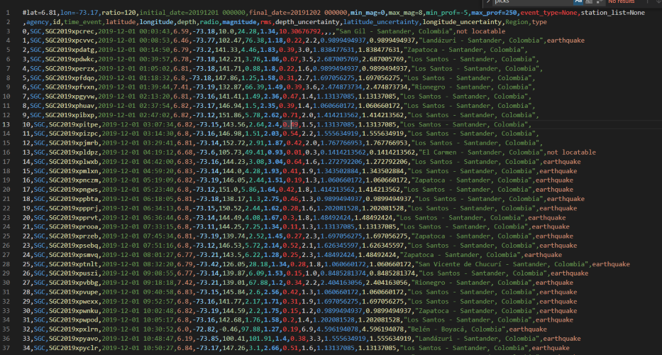

<!-- .element width="700"-->

# ConsultaSQL

Rutina realizada para realizar consulta a la base de datos. (Se puede hacer simple, por id o radial). Revisar las isntrucciones.  

<!-- .element width="700"-->

## 1. Instalación en linux

### - Requerimientos previos
Se corre en sistemas linux.

### - Python
Python Versión 3.7 en adelante. (Usaremos como ejemplo python 3.8)
```bash
sudo apt-get install python3.7 (o 3.8)
```

Tener virtualenv en python.
```bash
python3.7 -m pip install virtualenv
```

#### Instalación con pip 
```bash
python3.7 -m virtualenv .query
source .query/bin/activate
pip install -r requirements.txt
```
#### Instalación con pip 
```bash
conda env create -f enviroment.yml
conda activate php_query
```


## Instrucciones de uso

En los archivos '.ipynb' se muestra como usarlo en otros códigos. Si necesita correrlo en consola puede ver los siguientes ejemplos


### Comandos

```bash
+h, ++help            show this help message and exit
    
  REQUERIDOS:
  +m , ++mode           picks o events
  +s , ++start          Fecha inicial en formato 'yyyymmddThhmmss'
  +e , ++end            Fecha final en formato 'yyyymmddThhmmss'
  +m_mag , ++min_mag    Magnitud mínima
  +M_mag , ++max_mag    Magnitud máxima
  +m_prof , ++min_prof  Profundidad mínima
  +M_prof , ++max_prof  Profundidad máxima
  +o , ++out            csv format

  OPCIONALES:
  +et  [ ...], ++event_type  [ ...]  earthquake not_locatable explosion volcanic_eruption
  +sta  [ ...], ++station_list  [ ...]  BAR2 RUS PTB
  +id  [ ...], ++id  [ ...]  SGC2019xqwwuh SGC2019xpcvv
  +r  [ ...], ++radial  [ ...] Se debe especificar: lat lon r. Ejemplo: 6.81 -73.17 120
```

### Ejemplos

#### Picks

- simple

```bash
python run_query.py +m picks +s 20191201T000000 +e 20191202T000000 +m_mag 0 +M_mag 8 +m_prof -5 +M_prof 250 +o prove.csv
```

- id

```bash
python run_query.py +m picks +s 20191201T000000 +e 20191202T000000 +m_mag 0 +M_mag 8 +m_prof -5 +M_prof 250 +o prove.csv +id SGC2019xqwwuh SGC2019xpcvvc
```

-radial 
```bash
python run_query.py +m picks +s 20191201T000000 +e 20191202T000000 +m_mag 0 +M_mag 8 +m_prof -5 +M_prof 250 +o prove.csv +r 6.81 -73.17 120
```

#### Events

- simple

```bash
python run_query.py +m events +s 20191201T000000 +e 20191202T000000 +m_mag 0 +M_mag 8 +m_prof -5 +M_prof 250 +o prove.csv
```

- id

```bash
python run_query.py +m events +s 20191201T000000 +e 20191202T000000 +m_mag 0 +M_mag 8 +m_prof -5 +M_prof 250 +o prove.csv +id SGC2019xqwwuh SGC2019xpcvvc
```

-radial 
```bash
python run_query.py +m events +s 20191201T000000 +e 20191202T000000 +m_mag 0 +M_mag 8 +m_prof -5 +M_prof 250 +o prove.csv +r 6.81 -73.17 120
```


## Autor

- Emmanuel  Castillo ecastillo@sgc.gov.co


